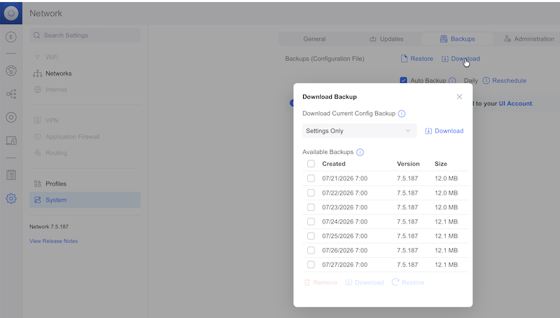
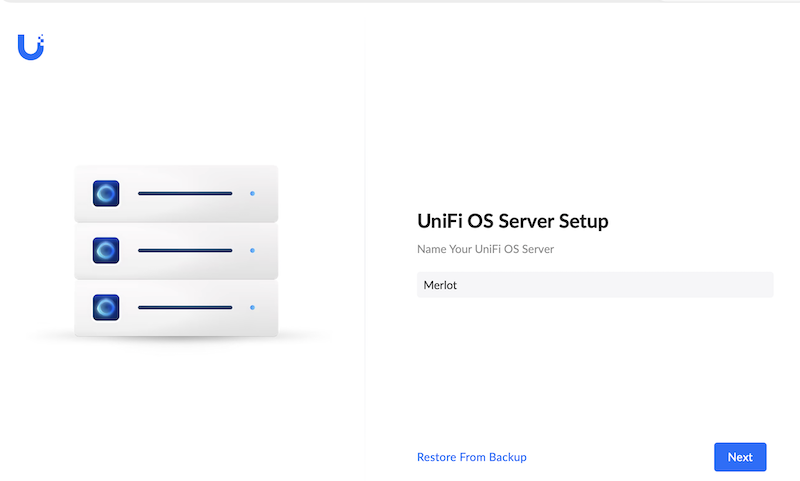
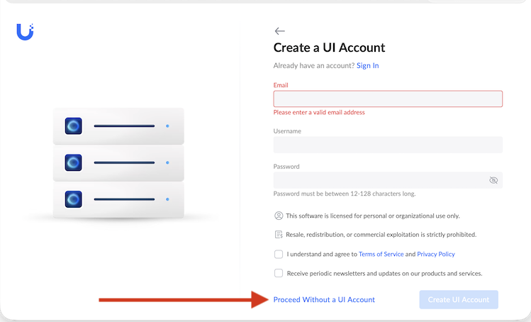
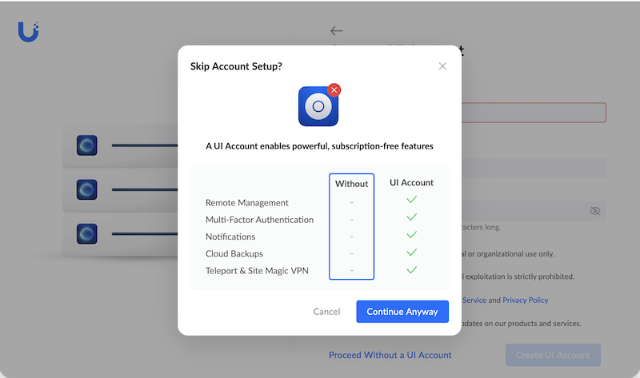
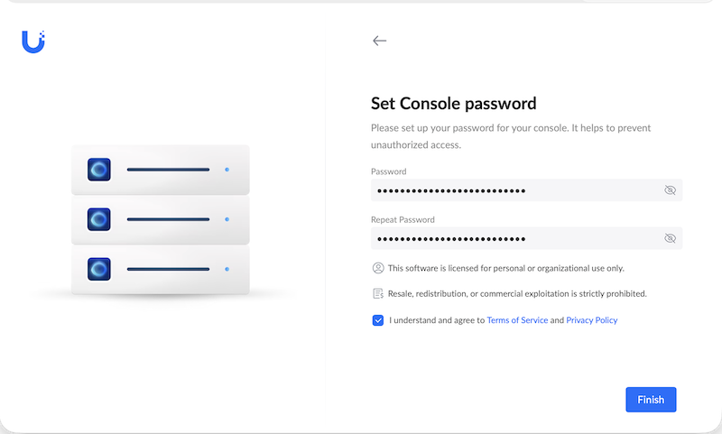
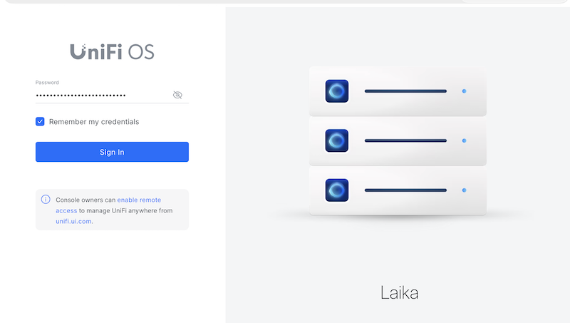
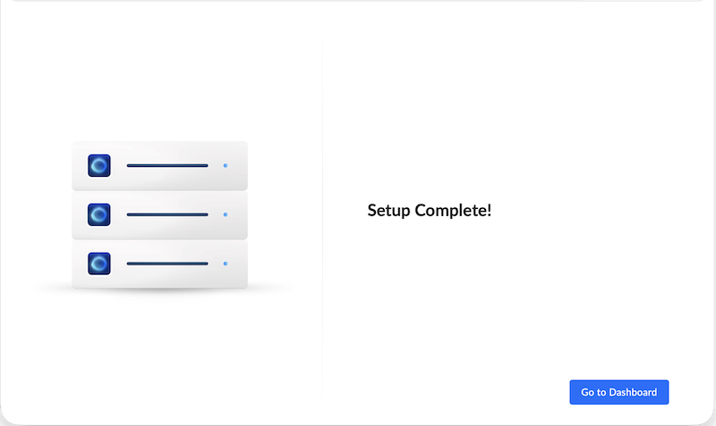
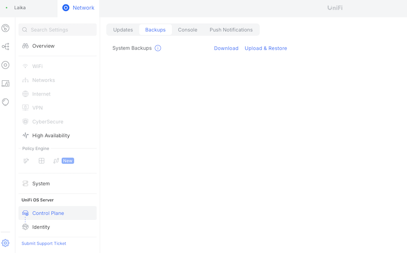

# zoe - Standing up the new Unifi OS Server

I run unifi switches and access points. To manage them I had been using the unifi provided docker containers. Recently ubiquity started promoting their on prem version of their cloud software. 

This is me installing this on an incus container and off of a docker vm.

## Standing up the container

```sh
incus launch trixie/cloud -p default -p merlot zoe -c security.privileged=true -c security.nesting=true -c security.syscalls.intercept.sysinfo=true -c security.syscalls.intercept.setxattr=true -c cloud-init.network-config="$(cat <<EOF
version: 2
ethernets:
  eth0:
    addresses:
      - 192.168.128.60
    gateway4: 192.168.128.1
    nameservers:
      addresses:
        - 192.168.128.2
EOF
)"
```

## Installing the unifi os server software

```sh
update.sh
apt install curl wget podman kmod nano net-tools openssh-server -y
echo -e '[storage]\ndriver = "vfs"\nrunroot = "/run/containers/storage"\ngraphroot = "/var/lib/containers/storage"' | sudo tee /etc/containers/storage.conf
mkdir -p /run/containers/storage
mkdir -p /var/lib/containers/storage
wget https://fw-download.ubnt.com/data/unifi-os-server/b828-linux-x64-5.1.19-e38d0b0e-b462-403d-9861-f57f25772106.19-x64
chmod +x ./b828-linux-x64-5.1.19-e38d0b0e-b462-403d-9861-f57f25772106.19-x64
 ./b828-linux-x64-5.1.19-e38d0b0e-b462-403d-9861-f57f25772106.19-x64
apt install -y nginx libnginx-mod-stream
mv /etc/nginx/sites-enabled/default /tmp/
cat >/etc/nginx/nginx.conf<<EOD
# ---- simplest redirection I could figure out

user www-data;
worker_processes auto;
pid /run/nginx.pid;

include /etc/nginx/modules-enabled/*.conf;

events {}


stream {

    upstream unifi {
        server 192.168.128.60:11443; #don't like the hard coded foo here
    } 

    server {
        listen        443;
        proxy_pass    unifi;
    }
}

http {
    server {
        listen 80 default_server;
        listen [::]:80 default_server;
        server_name _;
        return 301 https://$host$request_uri;
    }

    access_log /var/log/nginx/access.log;
    error_log /var/log/nginx/error.log;
    include /etc/nginx/conf.d/*.conf;
    include /etc/nginx/sites-enabled/*;
}
EOD
nginx -t
sytemctl enable --now nginx 
```

## Transferring data to new server.

- Start with a back up from the previous console
  
- Initialize application
    - 
    - 
    - 
    - 
- Log in
    - 
    - 
- Restore data from backup.
    -  
## References

- [https://discussion.scottibyte.com/t/self-hosted-unifi-os-in-an-incus-container/673](https://discussion.scottibyte.com/t/self-hosted-unifi-os-in-an-incus-container/673)
- [https://computingforgeeks.com/install-unifi-os-server-ubuntu/](https://computingforgeeks.com/install-unifi-os-server-ubuntu/)