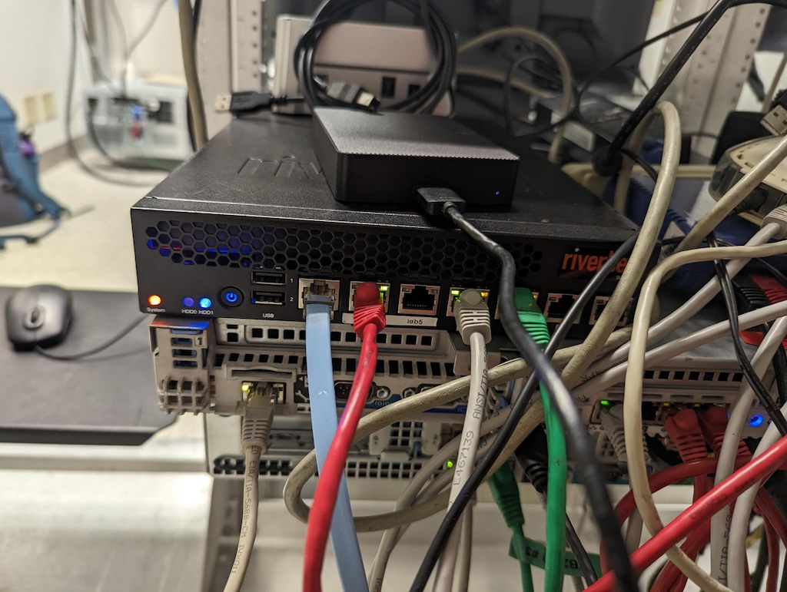

# Using a Tank for Crowd Control. -- DRAFT / Work In Progress --

## Overview

Now that we [have our proof of concept](https://www.digithink.com/rethinkeverything/norouter/wireguard-and-tinyproxy/) We are going to reimpliment it using physical hardware and harden it. The idea is to access the Admin lan without giving it any more access than it needs. The admin land has the servers lights out interfaces (ilo and drac) and allows direct communication between servers.

### Hardware

Our router was originally designed to be used with pfsense, a comercial product built around freebsd and its packet filtering system.


At home we run opnsense which is an open source replacement. At the colo we are going to strip it down to its underlying operating system and open source compontents.


### Components

#### Wireguard

(insert short description of wg) We originally set out to use several complicated vpns until we realized they were overkill.The configuration for wireguard is described in our [staging setup](https://www.digithink.com/rethinkeverything/norouter/wireguard-and-tinyproxy/)

#### TinyProxy

The only reason the servers would need to directly connect to anything is to get updates. For this a simple http proxy is all that we need. The configuration for tinyproxy is described in our [staging setup](https://www.digithink.com/rethinkeverything/norouter/wireguard-and-tinyproxy/).


#### Bind 9

When the main server is being worked on we completely lose DNS. So we provide the secondary. 

#### Dnsmasq

When talking to isolated internal machines its nice to have local dns. (also a dhcp server for the admin lan)

#### pf

Pf is bsd's packet filter system.

### Redundancy and remote control.

## Configuration / setup.

### Initial setup.

```
pkg upgrade
pkg install bind918-9.18.30
pkg install dnsmasq
pkg wireguard-tools-1.0.20210914_3
pkg install wireguard wireguard-tools
pkg install tinyproxy
nano /etc/rc.conf
hostname="sitka"
#ifconfig_igb4="DHCP"
ifconfig_igb4="inet 198.202.31.141 netmask 255.255.255.128"
defaultrouter="198.202.31.129"
ifconfig_igb0="inet 192.168.31.2 netmask 255.255.255.0"
sshd_enable="YES"
moused_nondefault_enable="NO"
# Set dumpdev to "AUTO" to enable crash dumps, "NO" to disable
dumpdev="AUTO"
zfs_enable="YES"
ipv6_enable="NO"
ipv6_network_interfaces="none"
ip6addrctl_enable="NO"
dnsmasq_enable="YES"
gateway_enable="YES"
```

### Wireguard

```
nano /usr/local/etc/wireguard/wg0
[interface]
Address = 10.0.0.11/32
ListenPort = 1194
PrivateKey = wKdjN83FosVXC1/MkG6aMnW3WJQBexdPhZrF3Ej2520=
#Biw53AZ3wWp4mr/iWfuZWi4eFPfFIYjOLT3weE7mFmI=

[amyl]
PublicKey = mxU1WAMJGg3Da5D47rP5OWVYOe4+dwQQum3IFVZHAFY=
AllowedIPs = 10.0.0.16/32
PreSharedKey=v5NK+hY10ZFTYnmuhoYBYkTEAq+RBmSLOV05MlPJ9R8=
```

## References

- https://www.digithink.com/rethinkeverything/norouter/wireguard-and-tinyproxy/
- https://forums.freebsd.org/threads/wireguard-network-setup.94793/
- https://forums.freebsd.org/threads/wireguard-setup-with-pf-problems.72623/
- https://vlads.me/post/create-a-wireguard-server-on-freebsd-in-15-minutes/
- https://freebsdsoftware.org/www/tinyproxy.html

### Wireguard
- https://herrbischoff.com/2023/04/freebsd-how-to-set-up-a-simple-and-actually-working-wireguard-server/
- https://forums.freebsd.org/threads/simple-and-secure-vpn-in-freebsd-introducing-wireguard.78628/
- https://www.zenarmor.com/docs/network-security-tutorials/how-to-install-wireguard-on-freebsd