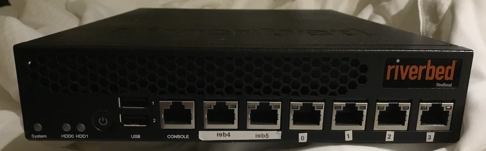

# Using a Tank for Crowd Control. -- DRAFT / Work In Progress --

Now that we [have our proof of concept](https://www.digithink.com/rethinkeverything/norouter/wireguard-and-tinyproxy/) We are going to reimpliment it using physical hardware and harden it. 

## Hardware

## Components

### Wireguard

### TinyProxy

### pf

## References

- https://www.digithink.com/rethinkeverything/norouter/wireguard-and-tinyproxy/
- https://forums.freebsd.org/threads/wireguard-network-setup.94793/
- https://forums.freebsd.org/threads/wireguard-setup-with-pf-problems.72623/
- https://vlads.me/post/create-a-wireguard-server-on-freebsd-in-15-minutes/
- https://freebsdsoftware.org/www/tinyproxy.html