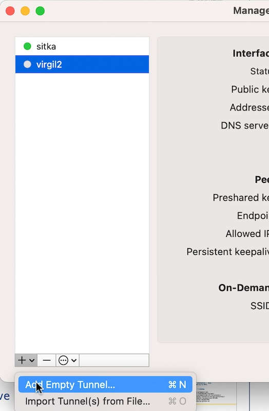
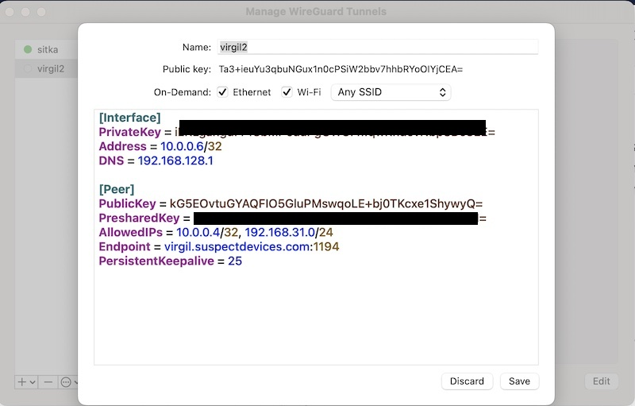
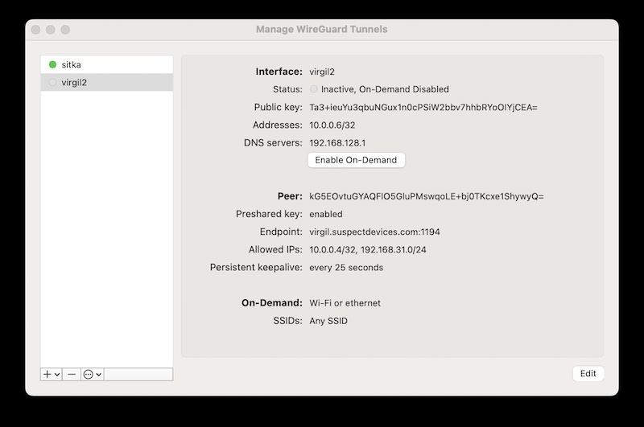

# Wireguard and Tinyproxy

( add the freebsd configuration sections )

After working through the complexities of using headscale/tailscale I realized that I really only needed the colo router to do 2 things.

1. Provide us access to the admin lan (the servers and their remote consoles).

    ```mermaid
    graph LR
    D([192.168.31.0/24])<-->A[Host interface]
    D<-->E[Host Drac/ILO]
    C[laptop] <-- Wireguard --> B(sitka/virgil);
    B <-- Wireguard -->D;
    ```

2. Allow the servers to reach the update repositories.

    ```mermaid
    graph LR
    B --> I([internet])
    A[Host] -- Apt Via Proxy --> B(sitka/virgil);
    ```
 
To do this and to provide redundant routes to the admin lan we take two approaches.

1. Replace the router with a container.
2. Replace the router with a better one.

## Replacing the colo router with a container.


By using a container with access to both the external lan and the admin lan we can set up wireguard and tinyproxy. Wireguard allows us to securely connect to the admin lan while tinyproxy allows the servers a mechanism to recieve software updates. This will become a staging/test setup for [the colo firewall](https://www.digithink.com/rethinkeverything/buildnotes/using-a-tank-for-crowd-control/).

### SETTING UP THE CONTAINER
To be able to do its job the container needed to be privilaged and it also would not run on 22.04. Its ok 22.04 still has a few years of support left.
```sh
root@aoc2024:~# lxc init ubuntu:22.04 homer -c security.privileged=true -p susdev23 -p infra
root@aoc2024:~# lxc config edit homer
name: homer
description: "wireguard/squid host"
...
devices:
  eth1:
    name: eth1
    nictype: bridged
    parent: br3
    type: nic
^x
root@aoc2024:~# lxc start homer
root@aoc2024:~# lxc exec homer bash
root@homer:~# nano /etc/netplan/50-cloud-init.yaml
network:
    version: 2
    ethernets:
        eth0:
            addresses:
            - 198.202.31.227/25
            nameservers:
                addresses:
                - 198.202.31.132
                - 8.8.8.8
                search:
                - suspectdevices.com
                - styx.suspectdevices.com
            routes:
            -   to: default
                via: 198.202.31.129
        eth1:
            addresses:
            - 192.168.31.227/24
^x
root@homer:~# netplan apply
```

Backcheck the interfaces

```sh
root@homer:~# ip a
1: lo: <LOOPBACK,UP,LOWER_UP> mtu 65536 qdisc noqueue state UNKNOWN group default qlen 1000
    link/loopback 00:00:00:00:00:00 brd 00:00:00:00:00:00
    inet 127.0.0.1/8 scope host lo
       valid_lft forever preferred_lft forever
45: eth0@if46: <BROADCAST,MULTICAST,UP,LOWER_UP> mtu 1500 qdisc noqueue state UP group default qlen 1000
    link/ether 00:16:3e:ba:f0:be brd ff:ff:ff:ff:ff:ff link-netnsid 0
    inet 198.202.31.228/25 brd 198.202.31.255 scope global eth0
       valid_lft forever preferred_lft forever
47: eth1@if48: <BROADCAST,MULTICAST,UP,LOWER_UP> mtu 1500 qdisc noqueue state UP group default qlen 1000
    link/ether 00:16:3e:2e:6f:d8 brd ff:ff:ff:ff:ff:ff link-netnsid 0
    inet 192.168.31.228/24 brd 192.168.31.255 scope global eth1
       valid_lft forever preferred_lft forever
```

### Install prerequisites and enable ip forwarding

The next few sections are done on the gateway container (virgil)

```sh
apt install wireguard
apt install resolvconf
sysctl -w net.ipv4.ip_forward=1
```


## Wireguard

### Set up wireguard 

#### Server Setup

```sh
cd /etc/wireguard/
wg genkey | sudo tee private.key
chmod go= private.key
cat private.key | wg pubkey | sudo tee public.key
wg genpsk |tee preshared.psk
nano /etc/wireguard/wg0.conf
```

```ini
# wg0.conf
[Interface]
Address = 10.0.0.1/32
ListenPort = 1194
PrivateKey = <<contents of private.key>>
PostUp = iptables -A FORWARD -i %i -j ACCEPT; iptables -t nat -A POSTROUTING -o eth1 -j MASQUERADE
PostDown = iptables -D FORWARD -i %i -j ACCEPT; iptables -t nat -D POSTROUTING -o eth1 -j MASQUERADE

# merlot
[Peer]
PublicKey = <<contents of public.key>>
AllowedIPs =  10.0.0.2/32,192.168.128.0/17
PresharedKey = <<contents of preshared.key>>

# amyl dons laptop
[Peer]
PublicKey = <<key from wireguard client>>
AllowedIPs = 10.0.0.6/32
PresharedKey = <<contents of preshared.key>>
```
##### Enable it

```sh
wg-quick up wg0
systemctl enable wg-quick@wg0
```

#### Client Configuration.
To avoid contention please reference the [ips spreadsheet](https://docs.google.com/spreadsheets/d/1KRkqdYvgRtV4vu6AGzdLWJVGTIsV2o2iSSJBEFMZJAw/edit?gid=308028290#gid=308028290) under the 10.0.0.x tab. 

##### MacOs client
To add the wireguard server to macos go to manage-tunnels and hit the + ->Add empty tunnel.... \<SPLAT-N>


You will get a form which includes the clients public key, its private key and a lot of white space.

*Use the public key to fill in the peer section on the server (as pre done above)* and then flesh in the local interface and peer details. 


The interface address is the unique address of the peer on the wireguard network. The interface dns will be the local dns server.

The peer data can be found in the files cited above. 
When finished press save. The AllowedIPs should include the wireguard servers wg address *and any ips routed through it* (in the above case the admin lan at the colo).



To select the connection double click on the tunnel and press the Enable On-Demand button. 

Then test it. 
```
feurig@Amyl ~ % ssh root@192.168.31.159
...
root@tk2022:~#
```


##### Linux client

Example setup using virgil as server....

On the client generate the pub/private keys.

```sh
apt install wireguard resolvconf
cd /etc/wireguard/
wg genkey > private.key
wg pubkey < private.key > public.key
chmod o-rwx *
```

on the server add the client as a peer.

```sh
nano /etc/wireguiard/wg0.conf
...
# otto
[Peer]
PublicKey = <public key from above>
AllowedIPs = 10.0.0.8/32
PresharedKey = <preshared key from server setup>
...
^X
systemctl restart wg-quick@wg0
```

On the client create configuration with server as peer.

```
cd /etc/wireguard
nano wg0.conf
[Interface]
PrivateKey = <private key from above>
Address = 10.0.0.8/32
DNS = 192.168.31.141

[Peer]
PublicKey = <public key from server>
PresharedKey = <preshared key from server setup>
AllowedIPs = 10.0.0.4/32, 192.168.31.0/24
Endpoint = virgil.suspectdevices.com:1194
PersistentKeepalive = 25
^X
wg-quick up wg0
ping 192.168.31.2
```


## No ~~Squid~~ 

The last update to squid completely overwrote its working configuration file without even making a backup copy. Can you say exposure and disfunction?
FRACK THAT. IT'S GONE.

```sh
root@virgil:/etc/squid# apt remove --purge squid
```

## TinyProxy -- proxy for main server and router.

### Setting up TinyProxy

The example below is on virgil (x.x.x.228) sitka is described in [her build notes](https://www.digithink.com/rethinkeverything/buildnotes/using-a-tank-for-crowd-control/) (x.x.x.2)

```sh
apt install tinyproxy -y
systemctl enable tinyproxy
cd /etc/tinyproxy/
cp tinyproxy.conf tinyproxy.conf.noisy
grep -v "^\#" tinyproxy.conf.noisy |grep -v "^$" >tinyproxy.conf
nano tinyproxy.conf
```

```sh
User tinyproxy
Group tinyproxy
Port 3128
Listen 192.168.31.228
Timeout 600
DefaultErrorFile "/usr/share/tinyproxy/default.html"
StatFile "/usr/share/tinyproxy/stats.html"
LogLevel Info
PidFile "/run/tinyproxy/tinyproxy.pid"
MaxClients 10
Allow 192.168.31.1/24
ViaProxyName "tinyproxy"
```

```sh
systemctl enable tinyproxy
systemctl start tinyproxy
```

### Test the proxy

```sh
root@kb2018:~# curl -x 192.168.31.228:3128 http://archive.ubuntu.com/ubuntu
<!DOCTYPE HTML PUBLIC "-//IETF//DTD HTML 2.0//EN">
<html><head>
<title>301 Moved Permanently</title>
</head><body>
<h1>Moved Permanently</h1>
<p>The document has moved <a href="http://archive.ubuntu.com/ubuntu/">here</a>.</p>
<hr>
<address>Apache/2.4.52 (Ubuntu) Server at archive.ubuntu.com Port 80</address>
</body></html>
```

### Set up apt to use proxy

```sh
nano /etc/apt/apt.conf.d/80proxy.conf
```

```sh
Acquire::http::Proxy "http://192.168.31.227:3128/";
```

### Test apt through proxy

```sh
root@aoc2024:/etc/apt/apt.conf.d# ip route delete default
root@aoc2024:/etc/apt/apt.conf.d# ip route
192.168.31.0/24 dev br3 proto kernel scope link src 192.168.31.158
root@aoc2024:/etc/apt/apt.conf.d# apt update
Hit:1 http://us.archive.ubuntu.com/ubuntu noble InRelease
Get:2 https://pkgs.tailscale.com/stable/ubuntu noble InRelease
Hit:3 http://us.archive.ubuntu.com/ubuntu noble-updates InRelease
Hit:4 http://security.ubuntu.com/ubuntu noble-security InRelease
Hit:5 http://us.archive.ubuntu.com/ubuntu noble-backports InRelease
Fetched 6575 B in 1s (9357 B/s)
Reading package lists... Done
Building dependency tree... Done
Reading state information... Done
All packages are up to date.
```

## References / Linkdump

- <https://www.wireguard.com>
- <https://www.freecodecamp.org/news/build-your-own-wireguard-vpn-in-five-minutes/>
- <https://linuxiac.com/how-to-use-apt-with-proxy/>
- <https://askubuntu.com/questions/257290/configure-proxy-for-apt#257296>
- <https://tinyproxy.github.io>

