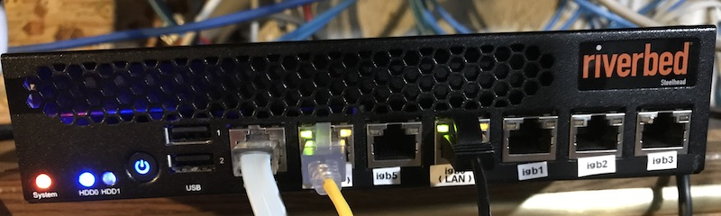

# Start making sense.

At work we use pf on freebsd-13.1 for our firewalls. I have been re-learning it as my freebsd-firewall experience is over 2 decades old. At home and in the colo we have been using openwrt which is great but a real pain to keep updated and deploy. 
I have been looking at pfsense and in the process, I discovered opnsense. If my BSD/PF chops ever get good enough I may go to straight freebsd but the convenience of guided configuration of a secure system is hard to ignore [[1]](#fn1)

## The hardware 

 As I was considering looking at pfsense I scored a pair of routers with 6x1G ports, and room for a pair of ssds.

First thing I did was to pull the os disk and replace it with a 1T ssd and upgrade the memory. The second thing I did was to replace the fans with quieter ones and print a pair of noise reducing mufflers. (I should blog about this on suspect devices at some point)

After that I installed opensense and started working on my list of things to do. 

### The goal: Consolidate home network using OPNSense.
- [x] REMOVE openwrt router
- [x] REMOVE dedicated caching server (Done)
- [x] REMOVE dedicated dnsmasq server
- [ ] REMOVE (that f**king centurylink router)
- [x] KEEP Pihole-FTL dns based blacklisting
- [ ] ADD Better firewall rules
- [ ] ADD VPN acces to home network
- [ ] ADD Isolated Wireless network for solar array controller.

### Footnotes/Sarcasms
<a name=fn1>1).</a>
On the other hand having a gui make things easier makes it easy to break things and less easy to debug them.  (having managed to brick the home network trying to add an isolated wireless network)
