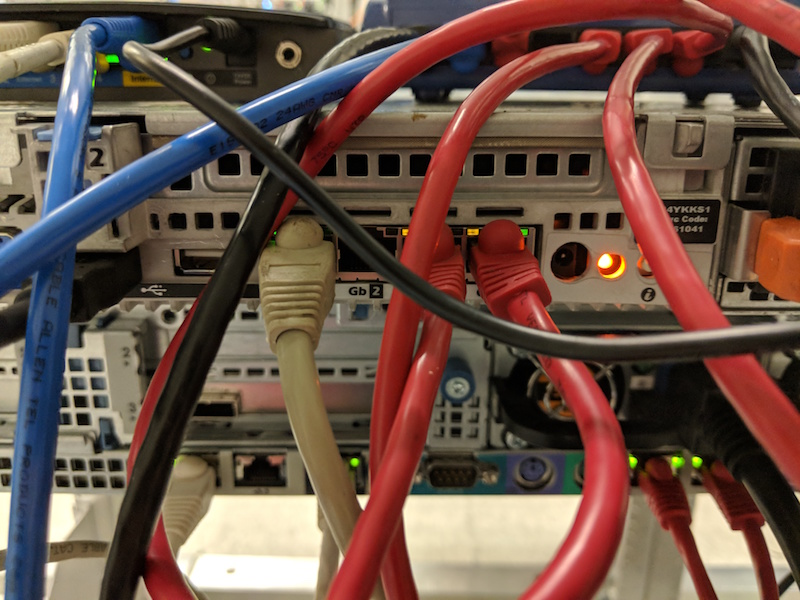
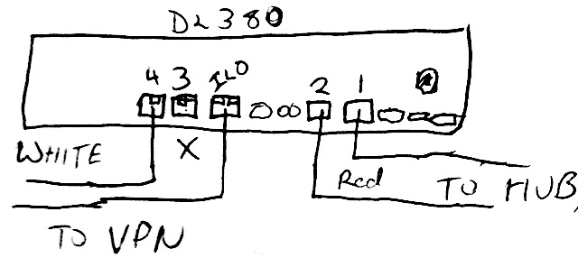
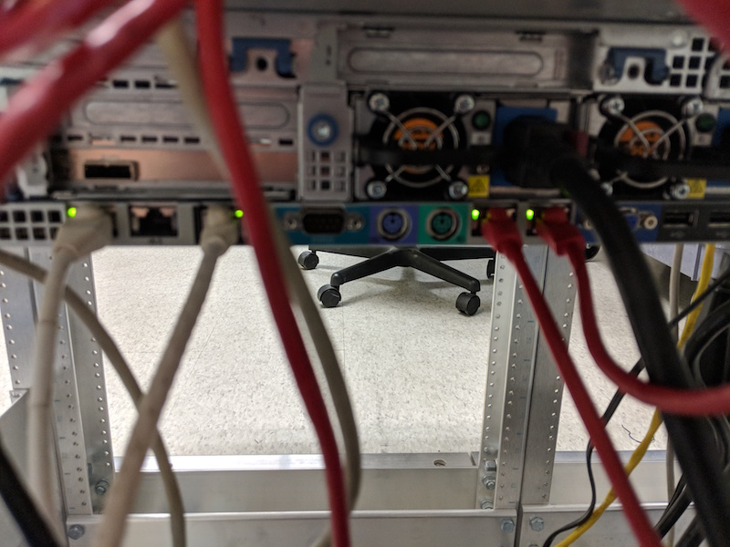

<!-- OperationsGuide, Version: 28, Modified: 2020/12/02, Author: feurig -->
# Server Modernization
## Overview 


### Phase I

Phase one of the server modernization shifted away from multipurposed servers and kvms to lxc/lxd based containers.

* Moving all legacy system functions onto separate linux containers isolated from each other.
* Use mirrored disk systems to insure that disk corruption does not lead to data corruption.
* Start giving a shit about the systems, code, and sites on them.
* Own your code/data. (If your free code hosting system is shutdown or taken over by Microsoft is it really free)

### Server Modernization Phase II

Phase two extends on this by integrate Ansible into system maintenance tasks.

* Integrate Ansible into system maintenance tasks
* Reevaluate Centos and other RPM based containers built using playbooks vs profiles/scripts/cloud-init _while maintaining current security model_
* Develop off site backup strategy.
* Clean up the cruft (If it doesn't bring you joy DTMFA)

### SMP III _Make Shit Happen / Own Your Shit_

* Work on secure and efficient traffic in and out of home lans (Privoxy,DNS based ad blocking,squid etc) 
* Continue to refine server operation/maintanance.
* Build Gitlab and other alternatives to trac/git and evaluate workflows.
* Deploy off site backup strategy.
* Build out content. 
* Start new projects.
* Distribute data and backups over the network to home servers.
* [Document home server/network setup](edge-server-configuration/)


### Goals.

* Security
* Flexibility
* Simplification

### Isolation

* network
* performance
* disk

## Hardware

At present the environment  contains a vpn capable router (Knight) and two enterrise class servers 

* aoc2024 , a Dell PowerEdge R610 [[br]]and 
* kb2018 a HP ProLiant DL380 (g7) .

## Network

The network is divided into 3 segments 

* 192.168.31.0/24 a private administrative lan
* tbd.tbd.tbd.tbd/? a private vpn for home offices
* 198.202.31.129/25 A public facing lan.

The hosts themselves do not have any public facing interfaces and are only accessible though the admin lan. The containers which handle all public facing work do so via an anonymous bridge configuration, allowing them to access the internet directly without allowing external access to the servers.

### AOC network config

|   |   |   |   |  aoc2024 ports|
|---|---|---|---|-----------------|
|port| Interface| IP Address/mask |  linux device| purpose|
| 1 |  eno1  |   192.168.31.158/24  | eno1 |internal / admin lan|
| 2 |  ?  | ?.?.?.?/?? | eno2 | vpn for home/office networks|
| 3 |  br1  | 0.0.0.0/0 | eno3 |Public Interface for infrastructure servers|
| 4 |  br0  |  0.0.0.0/0 | eno4 |Public Interface for dev/deploymant servers|
| idrac |   |  192.168.31.121/24 | |remote console|

As Drawn|As Deployed.
---|---
 | 

/etc/netplan/00-allthethings.yml
```
network:
  ethernets:
    eno1:
      dhcp4: false
      dhcp6: false
    eno2:
      dhcp4: false
      dhcp6: false
    eno3:
      dhcp4: false
      dhcp6: false
    eno4:
      dhcp4: false
      dhcp6: false
  bridges:
    br1:
      dhcp4: false
      dhcp6: false
      interfaces:
         - eno4
    br0:
      dhcp4: false
      dhcp6: false
      interfaces:
         - eno3
    br3:
      dhcp4: false
      dhcp6: false
      addresses:
      - 192.168.31.158/24
      routes:
      - to: default
        via: 192.168.31.1
      nameservers:
        addresses:
        - 198.202.31.132
        - 198.202.31.141
        search: [suspectdevices.com fromhell.com vpn]
      interfaces:
         - eno1

  version: 2
```

### KB2018 Network Config

|   |   |   |   |    kb2018 ports|
|---|---|---|---|-----------------|
|port| Interface|IP Address/mask |  linux device| purpose |
| 4 |  enp4s0f1  |   192.168.31.159/24  | enp4s0f1 |internal / admin lan  |
| 3 |  enp4s0f0  | ?.?.?.?/?? | enp4s0f0 | vpn for home/office networks  |  
| 2 |  br1  | 0.0.0.0/32 | enp3s0f1 |Public Interface for infrastructure servers|
| 1 |  br0  |  0.0.0.0/32 | enp3s0f0 |Public Interface for dev/deploymant servers|
| ilo |   |  192.168.31.119/24 | |remote console|

As Drawn|As Deployed.
---|---
 | 

#### As implimented in /etc/netplan/xxxxx

```
network:
  ethernets:
    enp3s0f0:
      dhcp4: false
      dhcp6: false
    enp3s0f1:
      dhcp4: false
      dhcp6: false
    enp4s0f0:
      dhcp4: false
      dhcp6: false
    enp4s0f1:
      dhcp4: false
      dhcp6: false
  bridges:
    br1:
      dhcp4: false
      dhcp6: false
      interfaces:
         - enp4s0f1:
    br0:
      dhcp4: false
      dhcp6: false
      interfaces:
         - enp4s0f0:
    br3:
      dhcp4: false
      dhcp6: false
      addresses:
      - 192.168.31.159/24
      routes:
      - to: default
        via: 192.168.31.1
      nameservers:
        addresses:
        - 198.202.31.132
        - 198.202.31.141
        search: [suspectdevices.com fromhell.com vpn]
      interfaces:
         - enp4s0f1

  version: 2
```

See: ​[https://bitbucket.org/suspectdevicesadmin/ansible/src/master/hosts](https://bitbucket.org/suspectdevicesadmin/ansible/src/master/hosts) which is built referencing [a google doc with proposed allocations](https://docs.google.com/spreadsheets/d/1KRkqdYvgRtV4vu6AGzdLWJVGTIsV2o2iSSJBEFMZJAw/edit#gid=0)

## Server OS, Filesystems and Disk layout
The servers are both running a standard install Ubuntu Server LTS, along with the Canonical supported LXD "snap". Outside of zfs not much is added to the stock installation. This is intentional. Since the real work is done by the containers the host os is considered disposable and can be rebuilt without effecting production.

### Disk Layout
The system disks on both servers use hardware raid 1+0 mirroring. The containers are able to take advantage of zfs mirroring and caching. 

|   |   |   |   |   |    bs2020 disks|
|---|---|---|---|---|-----------------|
|disk|device/pool | bay |  type|mount point(s)|purpose/notes| 
|   |   |   |   |   |   Host Machine Disks  |
|sdg|/dev/sdg|0|ext4|/|root filesytem (hardware raid)|
|sdg|/dev/sdg|1|ext4|/|mirror|
|sda1|/dev/sda1|external|ext4|/archive|backup staging|
|   |   |   |   |   |   development zfs pool  |
|sdc|devel|2|zfs|/var/lib/lxd/storage-pools/devel|dev/deployment (www,trac,usw)|
|sdd|devel|3|zfs| | mirror |
|   |   |   |   |   |   development zfs pool  |
|sdd|infra|4|zfs|/var/lib/lxd/storage-pools/infra|infrastructure (email,dns,usw)|
|sde|infra|5|zfs| | mirror |

On kb2018 the second pair of disks are Solid State. The first partition on each is a mirrored pair for the infrastructure zfs pool. The remaining partitions are for zfs caching.

|   |   |   |   |   |   kb2018 disks|
|---|---|---|---|---|-----------------|
| disk| device/pool | bay |  type| mount point(s)| purpose/notes| 
|   |   |   |   |   |   Host Machine Disks  |
|sda|/dev/sda|0|ext4|/|root filesytem (hardware raid)|
|sda|/dev/sda|1|ext4|/|mirror|
|   |   |   |   |   |   infrastructure zfs pool  |
|sdb1|infra|2|zfs|/var/lib/lxd/storage-pools/infra|infrastructure (email,dns,usw)|
|sdc1|infra|3|zfs| | mirror |
|   |   |   |   |   |   development zfs pool  |
|sdd|devel|4|zfs|/var/lib/lxd/storage-pools/devel|dev/deployment (www,trac,usw)|
|sde|devel|5|zfs| | mirror |
|sdb2|devel|2|zfs| | zfs cache (proposed) |

### Hardware raid on the DL380

The raid controller on the Dell allows a mixing of hardware raid and direct hot swappable connections. The HP 420i does only hardware raid or direct connections (HBA) but not both. Since we use the hardware raid the remaining disks need to be configured using the ssacli or the raid controllers bios.
See: DudeWhereAreMyDisks

## Containers

Work previously done by standalone servers is now done though LXD managed containers. [#fn1 (1)]
An up to date list of containers is maintained at  https://bitbucket.org/suspectdevicesadmin/ansible/src/master/hosts''

## Ansible

Ansible is used to make most tasks reasonable including.
* creating containers
* updating containers
* updating admin passwords and ssh keys.
* accessing 

# Tasks: Accessing Hosts
### bs2020/kb2020 ssh access
The host machines for the containers can be accessed through the admin lan. Currently this is done through ssh redirection. Eventually it will require a vpn connection. Only ssh key access is allowed and root is not allowed to login. To escalate privileges requires sudo. 

 
#### Current ssh port mappings to vpn.suspectdevices.com

| port | destination |
|----|-----------|
| 22  | bs2020 ssh via admin lan |
| 222 | bs2020 racadm / serial console via ssh |
| 2222 | knight / vpn |
| 22222 |kb2018 ssh via admin lan |
| 22223 |kb2018 hpILO / serial console via ssh |
 
_note: as of a few updates ago you have to tell apples ssh client to use ssh-dss as below_
	
	steve:~ don$ ssh -p22223 -oHostKeyAlgorithms=+ssh-dss feurig@bs2020.suspectdevices.com
	User:feurig logged-in to kb2018.suspectdevices.com(192.168.31.119 / FE80::9E8E:99FF:FE0C:BAD8)
	iLO 3 Advanced for BladeSystem 1.88 at  Jul 13 2016
	Server Name: kb2018
	Server Power: On
	
	</>hpiLO-> vsp
	
	Virtual Serial Port Active: COM2
	
	Starting virtual serial port.
	Press 'ESC (' to return to the CLI Session.
	
	Ubuntu 18.04.1 LTS kb2018 ttyS1
	
	kb2018 login: <ESC> (
	</>hpiLO-> exit
	steve:~ don$ ssh -p 222 feurig@vpn.suspectdevices.com
	...
	/admin1-> console com2
	Connected to Serial Device 2. To end type: ^\
	
	Ubuntu 18.04.1 LTS bs2020 ttyS1
	
	bs2020 login: <CTL> \
	/admin1-> exit
	CLP Session terminated
	Connection to vpn.suspectdevices.com closed.
	steve:~ don$ 
	
	
_ if the serial port is still in use do the following _
	
	Virtual Serial Port is currently in use by another session.
	</>hpiLO-> stop /system1/oemhp_vsp1
	
### bs2020/kb2018 graphical console access

bs2020 allows complete control of the system via a Dell Idrac 6 controller. This also requires access to the admin lan. This is described on the [wiki:NotesOnIdrac6 Idrac 6 page]
kb2020 allows similar using the on board described on the [wiki:NotesOnILO3 ILO 3 Notes page.]

### ssh access to containers

The susdev profile adds ssh keys and sudo passwords for admin users allowing direct ssh access to the container.
	
	steve:~ don$ ssh feurig@ian.suspectdevices.com
	...
	feurig@ian:~$ 
	
The containers can be accessed directly from the lxc/lxd host as root
	
	root@bs2020:~# lxc exec harvey bash
	root@harvey:~# apt-get update&&apt-get -y dist-upgrade&& apt-get -y autoremove
	

## Updating dns

Dns is provided by bind , The zone files have been consolidated into a single directory under /etc/bind/zones  on naomi (dns.suspectdevices.com).
	
	root@naomi:/etc/bind/zones# nano suspectdevices.hosts
	...
	@               IN      SOA  dns1.digithink.com. don.digithink.com (
	                2018080300 10800 3600 3600000 86400 )
	;               ^^ update ^^
	; .... make some changes ....
	morgan          IN      A       198.202.31.224
	git             IN      CNAME   morgan
	...
	root@naomi:/etc/bind/zones# service bind9 reload
	root@naomi:/etc/bind/zones# tail /var/log/messages
	...
	Sep  3 08:10:04 naomi named[178]: zone suspectdevices.com/IN: loaded serial 2018080300
	Sep  3 08:10:04 naomi named[178]: zone suspectdevices.com/IN: sending notifies (serial 2018080300)
	Sep  3 08:10:04 naomi named[178]: client 198.202.31.132#56120 (suspectdevices.com): transfer of 'suspectdevices.com/IN': AXFR-style IXFR started (serial 2018080300)
	Sep  3 08:10:04 naomi named[178]: client 198.202.31.132#56120 (suspectdevices.com): transfer of 'suspectdevices.com/IN': AXFR-style IXFR ended
	Sep  3 08:10:04 naomi named[178]: client 198.202.31.132#47381: received notify for zone 'suspectdevices.com'
	
	
## Updating Hosts / Containers

When updates are available Apticron sends us an email. We prefer this to autoupdating our hosts as it helps us maintain awareness of what issues are being addressed and does not stop working when there are issues. All hosts in /etc/asnsible/hosts on kb2018 shoul be updated using the following add hoc command. 

	
	feurig@kb2018:~$ sudo bash
	....
	root@kb2018:~# ansible pets -m raw -a "update.sh"
	
https://bitbucket.org/suspectdevicesadmin/ansible/src/master/files/update.sh

## Creating containers
	
	ansible-playbook playbooks/create-lxd-containers.yml 
	
https://bitbucket.org/suspectdevicesadmin/ansible/src/master/roles/create_lxd_containers/tasks/main.yml
.....YOU ARE HERE.....
_documenting the ansible script to create containers_.

## Backing Up Containers

Backing up containers using ansible is depreciated. A python script and cron tab create nightly snapshots and moves them to bs2020.
	
	cd /etc/ansible ;screen -L time ansible-playbook playbooks/backup-lxd-containers.yml -vvv -i importants
	
https://bitbucket.org/suspectdevicesadmin/ansible/src/master/roles/snapshot_lxd_containers/tasks/main.yml

#  links.... (tbd)
