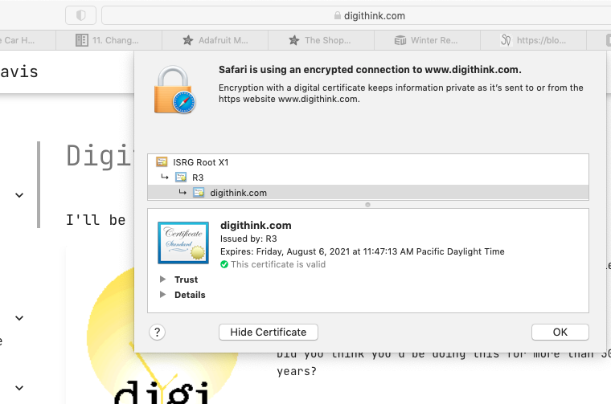

# Nginx Server Build
After lighthttpd left me with a broken configuration during the last round of updates, I started looking at nginx to serve the static sites previously served (www.digithink.com[this site], www.busholini.org). Since it and apache are both supported by the eff's certbot I was hoping that the automatic configuration and renewal features would work. And they did. 

## Nginx install.
### Broke it the first try.
Nginx's debian package installs a default web server configuration which breaks if ipv6 is disabled. This breaks at the package installation. Not cool at all.
#### The broken.

```
Job for nginx.service failed because the control process exited with error code.
See "systemctl status nginx.service" and "journalctl -xe" for details.
invoke-rc.d: initscript nginx, action "start" failed.
● nginx.service - A high performance web server and a reverse proxy server
     Loaded: loaded (/lib/systemd/system/nginx.service; enabled; vendor preset: enabled)
     Active: failed (Result: exit-code) since Sat 2021-05-08 09:34:46 PDT; 8ms ago
       Docs: man:nginx(8)
    Process: 10025 ExecStartPre=/usr/sbin/nginx -t -q -g daemon on; master_process on; (code=exited, status=1/FAILURE)

May 08 09:34:46 guenter systemd[1]: Starting A high performance web server and a reverse proxy server...
May 08 09:34:46 guenter nginx[10025]: nginx: [emerg] socket() [::]:80 failed (97: Address family not supported by protocol)
May 08 09:34:46 guenter nginx[10025]: nginx: configuration file /etc/nginx/nginx.conf test failed
May 08 09:34:46 guenter systemd[1]: nginx.service: Control process exited, code=exited, status=1/FAILURE
May 08 09:34:46 guenter systemd[1]: nginx.service: Failed with result 'exit-code'.
May 08 09:34:46 guenter systemd[1]: Failed to start A high performance web server and a reverse proxy server.
```

#### The fix.
To fix this we correct the bad configuration file that was installed and reinstall the package. I could also have (dpkg -a --configure)d here.

```
root@guenter:/etc/nginx# nano sites-available/default 
... comment out the [::]:80 ....
        #listen [::]:80 default_server;
...
root@guenter:/etc/nginx# apt-get install certbot nginx
Reading package lists... Done
Building dependency tree       
Reading state information... Done
nginx is already the newest version (1.18.0-0ubuntu1).
certbot is already the newest version (0.40.0-1ubuntu0.1).
0 upgraded, 0 newly installed, 0 to remove and 0 not upgraded.
2 not fully installed or removed.
After this operation, 0 B of additional disk space will be used.
Do you want to continue? [Y/n] 
Setting up nginx-core (1.18.0-0ubuntu1) ...
Setting up nginx (1.18.0-0ubuntu1) ...

```
### Adding content from other server.
Now that we have a working server we give it some content.

#### Copy content from lighttpd server.

    root@guenter:/var/www# tar -xzvf www.tgz 

#### Named Virtual Hosts


```
# nano /etc/nginx/sites-avaliable/default

server {
        listen 80;
#       listen [::]:80;
        server_name www.digithink.com;
        root /var/www/digithink/site;
        index index.html;
        location / {
                try_files $uri $uri/ =404;
        }
}

server {
        listen 80;
#       listen [::]:80;
        server_name www.busholini.org;
        root /var/www/busholini/www;
        index index.html;
        location / {
                try_files $uri $uri/ =404;
        }
}

```

### Add Certificate from Lets Encrypt.

Even though this site is static and public we still want to add SSL to the site to prevent the content from being altered along the way.

#### Certbot actually worked as advertized for the first time. 
The first couple of web pages I found on the web described the automagic creation and configuration of certificate and once I replaced python-certbot-nginx with python3-cerbot-nginx things actually went brilliantly. No more --manual reinstallation.

```
root@guenter:/var/www# apt-get install python3-certbot-nginx
Reading package lists... Done
...
Setting up python3-certbot-nginx (0.40.0-0ubuntu0.1) ...
root@guenter:/var/www# certbot --nginx -d digithink.com -d www.digithink.com
Saving debug log to /var/log/letsencrypt/letsencrypt.log
Plugins selected: Authenticator nginx, Installer nginx
Enter email address (used for urgent renewal and security notices) (Enter 'c' to
cancel): don@digithink.com

- - - - - - - - - - - - - - - - - - - - - - - - - - - - - - - - - - - - - - - -
Please read the Terms of Service at
https://letsencrypt.org/documents/LE-SA-v1.2-November-15-2017.pdf. You must
agree in order to register with the ACME server at
https://acme-v02.api.letsencrypt.org/directory
- - - - - - - - - - - - - - - - - - - - - - - - - - - - - - - - - - - - - - - -
(A)gree/(C)ancel: A

- - - - - - - - - - - - - - - - - - - - - - - - - - - - - - - - - - - - - - - -
Would you be willing to share your email address with the Electronic Frontier
Foundation, a founding partner of the Let's Encrypt project and the non-profit
organization that develops Certbot? We'd like to send you email about our work
encrypting the web, EFF news, campaigns, and ways to support digital freedom.
- - - - - - - - - - - - - - - - - - - - - - - - - - - - - - - - - - - - - - - -
(Y)es/(N)o: Y
Obtaining a new certificate
Performing the following challenges:
http-01 challenge for digithink.com
http-01 challenge for www.digithink.com
Waiting for verification...
Cleaning up challenges
Deploying Certificate to VirtualHost /etc/nginx/sites-enabled/default
Deploying Certificate to VirtualHost /etc/nginx/sites-enabled/default

Please choose whether or not to redirect HTTP traffic to HTTPS, removing HTTP access.
- - - - - - - - - - - - - - - - - - - - - - - - - - - - - - - - - - - - - - - -
1: No redirect - Make no further changes to the webserver configuration.
2: Redirect - Make all requests redirect to secure HTTPS access. Choose this for
new sites, or if you're confident your site works on HTTPS. You can undo this
change by editing your web server's configuration.
- - - - - - - - - - - - - - - - - - - - - - - - - - - - - - - - - - - - - - - -
Select the appropriate number [1-2] then [enter] (press 'c' to cancel): 2
Redirecting all traffic on port 80 to ssl in /etc/nginx/sites-enabled/default
Redirecting all traffic on port 80 to ssl in /etc/nginx/sites-enabled/default

- - - - - - - - - - - - - - - - - - - - - - - - - - - - - - - - - - - - - - - -
Congratulations! You have successfully enabled https://digithink.com and
https://www.digithink.com

You should test your configuration at:
https://www.ssllabs.com/ssltest/analyze.html?d=digithink.com
https://www.ssllabs.com/ssltest/analyze.html?d=www.digithink.com
- - - - - - - - - - - - - - - - - - - - - - - - - - - - - - - - - - - - - - - -

IMPORTANT NOTES:
 - Congratulations! Your certificate and chain have been saved at:
   /etc/letsencrypt/live/digithink.com/fullchain.pem
   Your key file has been saved at:
   /etc/letsencrypt/live/digithink.com/privkey.pem
   Your cert will expire on 2021-08-06. To obtain a new or tweaked
   version of this certificate in the future, simply run certbot again
   with the "certonly" option. To non-interactively renew *all* of
   your certificates, run "certbot renew"
 - Your account credentials have been saved in your Certbot
   configuration directory at /etc/letsencrypt. You should make a
   secure backup of this folder now. This configuration directory will
   also contain certificates and private keys obtained by Certbot so
   making regular backups of this folder is ideal.
 - If you like Certbot, please consider supporting our work by:

   Donating to ISRG / Let's Encrypt:   https://letsencrypt.org/donate
   Donating to EFF:                    https://eff.org/donate-le

root@guenter:/var/www# 
```

### Finishing up.

Part of this servers job is to serve this documentation. The static content is generated from markdown maintained in a git repository. To get the html we use mkdocs as described in [this document](https://www.digithink.com/buildnotes/mkdocs-server-configuration/mkdocs-server-configuration/). 


```
Hoffa-6:Documents don$ cd /Volumes/TheFlatField/static/digithink/docs/
Hoffa-6:docs don$ git add buildnotes/nginx-server-build.md 
Hoffa-6:docs don$ git commit -a -m"add ngnix server docs"
[main 44590d5] add ngnix server docs
 1 file changed, 188 insertions(+)
 create mode 100644 docs/buildnotes/nginx-server-build.md
Hoffa-6:docs don$ git push
...
To github.com:feurig/digithink.git
   8d8f2c1..44590d5  main -> main
Hoffa-6:docs don$ 
```

In order to pull the content we need to add the ssh key to the github repository.

```
root@guenter:/var/www/digithink/docs# git pull
The authenticity of host 'github.com (192.30.255.112)' can't be established.
RSA key fingerprint is SHA256:nThbg6kXUpJWGl7E1IGOCspRomTxdCARLviKw6E5SY8.
Are you sure you want to continue connecting (yes/no/[fingerprint])? yes
Warning: Permanently added 'github.com,192.30.255.112' (RSA) to the list of known hosts.
git@github.com: Permission denied (publickey).
fatal: Could not read from remote repository.
...
root@guenter:/var/www/digithink/docs# ssh-keygen 
Generating public/private rsa key pair.
Enter file in which to save the key (/root/.ssh/id_rsa): 
...
root@guenter:/var/www/digithink/docs# cat /root/.ssh/id_rsa.pub 
ssh-rsa AAAAB3NzaC1yc2EAAAADAQABAAABgQDjUUSJi9AOkqLW85EAUkmRGGbdRiACSKhtOTNifL4Twf/PQM/ViGIAj/nkA97fdvVRpA93f7C/9hXPGd+ZCe3S5mm2KN8yxi6pqq+y6AZ/vN58c3zeHT1YQerqzRM9WP59bQOq2uuLpH65BmcMwq1hLY+wHW5c+mIUyrWOictg0gT8QzZdJ95hFsUkkfQWi90PID1MmiWdNhnOKPqUHTjbdv4Vljg6OwgguRUJd2OGRxodRON0OuWqQK7A4JKqVF3LYk5ym0R+xWmFDaskxmTqlbHd1xeka4GturOec4GsJujl86iM1kre8v0Mgtw2Op+xRVlcd1ltlg1iTSNHGGx38X+x70SQCiErWDTVzxM90HgGG8enTN+3Mz69FZORmI2Ml0+sXesgWnblFbSNFCG0YytOVSWHORwc/+l1ZGP4AigCkQJ8/3pUex7ccJoFcvhbJ8e1KGRPnlL9/BVm3baZb8iATZMb8puZoMxE/kutM8nuhP+pjQ04iU2QXXl62xs= root@guenter

```

Then we can regenerate the content

```
root@guenter:/var/www/digithink/docs# git pull
Warning: Permanently added the RSA host key for IP address '192.30.255.113' to the list of known hosts.
...
create mode 100644 docs/buildnotes/nginx-server-build.md
root@guenter:/var/www/digithink/docs# cd ..
root@guenter:/var/www/digithink# ls
docs  mkdocs.yml  site
root@guenter:/var/www/digithink# nano mkdocs.yml 
root@guenter:/var/www/digithink# mkd
mkdir   mkdocs  
root@guenter:/var/www/digithink# git submodule sync
Synchronizing submodule url for 'docs/buildnotes/ansible'
Synchronizing submodule url for 'docs/buildnotes/edge-server-configuration'
root@guenter:/var/www/digithink# mkdocs build
INFO    -  Cleaning site directory 
INFO    -  Building documentation to directory: /var/www/digithink/site 
INFO    -  Number headings up to level 3. 
INFO    -  Generate a table of contents up to heading level 2. 
INFO    -  Generate a cover page with "default_cover.html.j2". 
INFO    -  Converting  alignment(workaround). 
INFO    -  Rendering for PDF. 
INFO    -  Output a PDF to "/var/www/digithink/site/pdf/document.pdf". 
INFO    -  Converting 93 articles to PDF took 41.1s 
INFO    -  Documentation built in 43.43 seconds 
root@guenter:/var/www/digithink# chown -R www-data:www-data site/
```
And life is good.


### Link Dump

* [https://webhostinggeeks.com/howto/static-website-configuration-for-nginx/](https://webhostinggeeks.com/howto/static-website-configuration-for-nginx/)
* [https://docs.nginx.com/nginx/admin-guide/web-server/serving-static-content/](https://docs.nginx.com/nginx/admin-guide/web-server/serving-static-content/)
* [https://medium.com/@jasonrigden/how-to-host-a-static-website-with-nginx-8b2dd0c5b301](https://medium.com/@jasonrigden/how-to-host-a-static-website-with-nginx-8b2dd0c5b301)
* [https://www.digithink.com/buildnotes/mkdocs-server-configuration/mkdocs-server-configuration/](https://www.digithink.com/buildnotes/mkdocs-server-configuration/mkdocs-server-configuration/)
* [https://www.digitalocean.com/community/tutorials/how-to-secure-nginx-with-let-s-encrypt-on-ubuntu-20-04](https://www.digitalocean.com/community/tutorials/how-to-secure-nginx-with-let-s-encrypt-on-ubuntu-20-04)