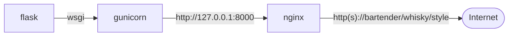
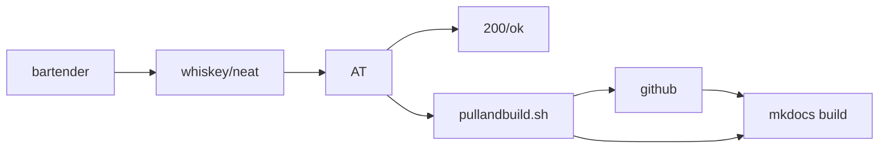

# Bartender: a wsgi server

I wanted to do a simple git hook for a static website or two where the content was pulled down and converted from markdown with a little mermaid to static html. I have been doing this manually for a while but it gets to be a pain and besides all the kids are doing ci-cd and I thought it might help me actually write more.

Once apon a time when apache was really the best way to serve http writing interactive sites in python was a matter of enableing mod_wsgi and throwing up 20 lines of python.

Gone are those days.

Three days of swimming through uwsgi, unit and 3 other overtly complicated half thought out python solutions all of which require a separate standalone service I settled on a flask and gunicorn. Its still a kludgy pile. Time to go queue TurboNegros "I hate the kids" and just make it work.

## The Stack





Installing the service.

```
apt install python3-flask
apt install python3-gunicorn

apt install at
echo www-data |tee /etc/at.allow
www-data
```


#### Nginx.conf

```
# lots of hard coded foo here
server {
    server_name bartender.digithink.com;

    listen 198.202.31.232:443 ssl;
    server_name bartender.digithink.com;
    ssl_certificate /etc/letsencrypt/live/bartender.digithink.com/fullchain.pem; # managed by Certbot
    ssl_certificate_key /etc/letsencrypt/live/bartender.digithink.com/privkey.pem; # managed by Certbot

    root /var/www/digithink/whiskey/bartender;
    index index.html;
    location /whiskey {
        include proxy_params;
        proxy_pass http://bartender/whiskey;
    }
}

server {
    root /var/www/digithink/whiskey/bartender;
    index index.html;
    if ($host = bartender.digithink.com) {
        return 301 https://$host$request_uri;
    } # managed by Certbot

    listen 198.202.31.232:80;
    server_name bartender.digithink.com;
    return 404; # managed by Certbot
}
```
```
apt remove mkdocs*
apt remove markdown
apt remove python3-markdown
pip3 install mkdocs-material --break-system-packages
cd /var/www/digithink/&& git pull && mkdocs build && chown -R www-data:www-data site/
nano mkdocs.yml
cd /var/www/digithink/&& git pull && mkdocs build && chown -R www-data:www-data site/
pip3 install mergedeep --break-system-packages
cd /var/www/digithink/&& git pull && mkdocs build && chown -R www-data:www-data site/
pip3 install yaml_env_tag --break-system-packages
apt isntall pyyaml
apt install pyyaml
apt install python-pyyaml
pip3 install pyyaml
pip3 install pyyaml --break-system-packages
mkdocs build
pip3 install  pyyaml_env_tag --break-system-packages
apt install python3-ghp-import
apt install python-ghp-import
pip3 install ghp-import --break-system-packages
pip3 install pathspec --break-system-packages
pip3 install watchdog --break-system-packages
mkdocs build
apt install python3-regex
mkdocs build
chown -R www-data:www-data site
su -l www-data
pip install mkdocs-mermaid2-plugin[test] --break-system-packages

```
## linkdump

- <https://github.com/codingforentrepreneurs/Pi-Awesome/blob/main/how-tos/Create%20a%20Minimal%20Web%20Application%20with%20Nginx%2C%20Python%2C%20Flask%20%26%20Raspberry%20Pi.md>
- <https://www.stackovercloud.com/2020/05/27/how-to-serve-flask-applications-with-uwsgi-and-nginx-on-ubuntu-20-04/>
- <https://www.digitalocean.com/community/tutorials/how-to-set-up-uwsgi-and-nginx-to-serve-python-apps-on-ubuntu-14-04>
- <https://stackoverflow.com/questions/10748108/nginx-uwsgi-unavailable-modifier-requested-0#11055729>

```

```
