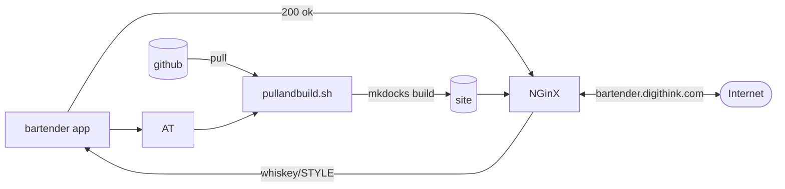

# Bartender: a wsgi server

I wanted to do a simple git hook for a static website or two where the content was pulled down and converted from markdown with a little mermaid to static html. I have been doing this manually for a while but it gets to be a pain and besides all the kids are doing ci-cd and I thought it might help me actually write more.

Once apon a time when apache was really the best way to serve http writing interactive sites in python was a matter of enableing mod_wsgi and throwing up 20 lines of python.

Gone are those days.

Three days of swimming through uwsgi, unit and 3 other overtly complicated half thought out python solutions all of which require a separate standalone service I settled on a flask and gunicorn. Its still a kludgy pile. Time to go queue TurboNegros "I hate the kids" and just make it work.

## The Stack




## The source code and the results.

- [https://github.com/feurig/digithink/tree/main/whiskey](https://github.com/feurig/digithink/tree/main/whiskey)
  The source code for the bartender service is in the same repository as the content it serves
- [https://www.digithink.com](https://www.digithink.com) is the target website.
- [https://bartender.digithink.com/](https://bartender.digithink.com/) contains this and the other documents for the service.

## Installing the service.

YOU ARE HERE DISCUSSING THE STUFF THAT MAKES IT WORK

```sh
apt install python3-flask
apt install python3-gunicorn

apt install at
echo www-data |tee /etc/at.allow
nano /etc/systemd/system/whiskey.service
[Unit]
Description=Gunicorn instance to serve whiskey
After=network.target

[Service]
User=www-data
Group=www-data
WorkingDirectory=/var/www/digithink/whiskey
#Environment="PATH=/home/sammy/myproject/myprojectenv/bin"
#     --bind unix:/run/whiskey.sock  \

ExecStart=/usr/bin/gunicorn \
     --workers 3 \
     --bind 127.0.0.1:5000 \
     --reload \
     --access-logfile /var/www/digithink/whiskey/logs/gunicorn_access.log \
     --error-logfile /var/www/digithink/whiskey/logs/gunicorn_error.log \
     -m 007 wsgi:app
ExecReload=/bin/kill -s HUP $MAINPID
ExecStop=/bin/kill -s TERM $MAINPID

[Install]
WantedBy=multi-user.target
^X
systemctl enable whiskey
systemctl start whiskey
```

### Nginx.conf

```sh
# lots of hard coded foo here
server {
    server_name bartender.digithink.com;

    listen 198.202.31.232:443 ssl;
    server_name bartender.digithink.com;
    ssl_certificate /etc/letsencrypt/live/bartender.digithink.com/fullchain.pem; # managed by Certbot
    ssl_certificate_key /etc/letsencrypt/live/bartender.digithink.com/privkey.pem; # managed by Certbot

    root /var/www/digithink/whiskey/bartender;
    index index.html;
    location /whiskey {
        include proxy_params;
        proxy_pass http://bartender/whiskey;
    }
    # point the error page to the one created by mkdocs
    error_page 404 /404.html;
    location  /404.html {
          internal;
    }

}

# redirect http to https
server {
    root /var/www/digithink/whiskey/bartender;
    index index.html;
    if ($host = bartender.digithink.com) {
        return 301 https://$host$request_uri;
    } # managed by Certbot

    listen 198.202.31.232:80;
    server_name bartender.digithink.com;
    return 404; # managed by Certbot
}
```

### the WSGI app
The actual app will grow into something with better feedback more general use (ie to make different static web sites)
#### drink.py, A Minimum Viable Product

```python
from flask import Flask
from markupsafe import escape
import subprocess

app = Flask(__name__)

@app.route("/whiskey/<style>",methods = ['POST', 'GET'])
def whiskey(style):
    # break this out by style.
    subprocess.call(['at', 'now', '-f', '/var/www/digithink/whiskey/pullandbuild.sh'])
    return f"One Whiskey, {escape(style)}!"
```

### wsgi.py, Turning the above into a WSGI 
```
from drink import app

if __name__ == "__main__":
    app.run()
```

## Converting the git content to a static html site.

### mkdocs plus the extensions

Ubuntu (... ok, debian really...) fracked up the packaging for mkdocs and mkdocs-material. I wound up removing the packages and pip3 installing most of it with --break-system-packages.

```
apt remove mkdocs*
apt remove markdown
apt remove python3-markdown
apt install python3-regex
apt install libvips-dev
apt install python3-pip
pip3 install mkdocs-material --break-system-packages
```
#### pull dependencies based on the current mkdocs install and mkdocs.yml
```
cd /var/www/digithink/&& git pull 
mkdocs-get-deps > requirements.txt
pip3 install $(mkdocs-get-deps) --break-system-packages
mkdocs build && chown -R www-data:www-data site/
```


## linkdump

- <https://github.com/codingforentrepreneurs/Pi-Awesome/blob/main/how-tos/Create%20a%20Minimal%20Web%20Application%20with%20Nginx%2C%20Python%2C%20Flask%20%26%20Raspberry%20Pi.md>
- <https://www.stackovercloud.com/2020/05/27/how-to-serve-flask-applications-with-uwsgi-and-nginx-on-ubuntu-20-04/>
- <https://www.digitalocean.com/community/tutorials/how-to-set-up-uwsgi-and-nginx-to-serve-python-apps-on-ubuntu-14-04>
- <https://stackoverflow.com/questions/10748108/nginx-uwsgi-unavailable-modifier-requested-0#11055729>
- https://github.com/mkdocs/get-deps

```

```
